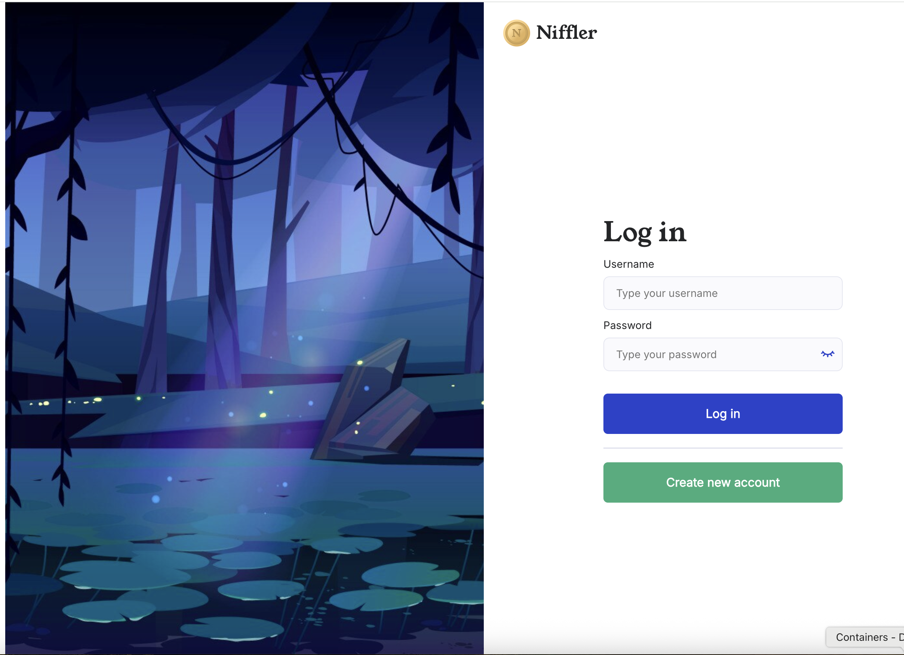
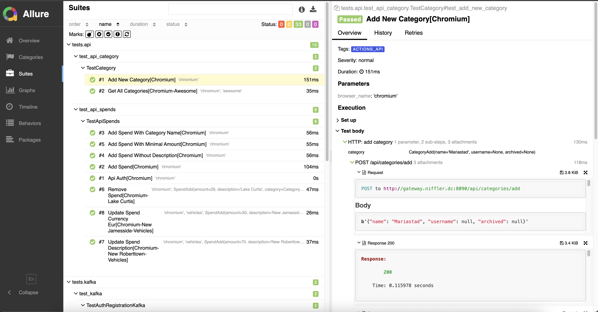

## Проект автоматизированного тестирования приложения Niffler (V3).

<p style="text-align: center;">
  <code>
    
  </code>
</p>

### Проект реализован с использованием технологий:

<div class="tech-icons">
  
  
  
  
  
  
  
  
  
  
  
</div>

### Особенности проекта:

* Созданы UI тесты с использованием PageObject и ООП на фреймворке `Playwright`
* Созданы UI тесты + DB с использованием передачи данных REST API
* Созданы тесты проверяющие передачу данных REST API + DB
* Созданы Е2Е тесты проверяющие очередь событий KAFKA -> DB -> API
* Созданы SOAP тесты проверяющие тестового пользователя
* Для создания отчетов тестирования применен Allure Reports
* Для повышения читаемости отчетов тестирования используется шаблонизатор `Jinja2`
* Для валидации и трансформации данных используется библиотека `Pydantic`
* Для запуска тестов и управлением тестовыми данными созданы специальные фикстуры
* Для управления и взаимодействия с БД используется `SQLAlchemy`
* Для параллельного запуска тестов используется библиотека `pytest-xdist`
* Проект использует кастомный logger для записей всех событий в log file
* В качестве CI/CD системы используется `GitHub Actions`

### Предусловие - сборка и установка проекта

- Скопировать проект на локальную машину
- Запустить desktop версию `Docker` локально на компьютере
- Запустить `Niffler` согласно README основного проекта.
- ВАЖНО! Установить Java версии 21. Это необходимо, т.к. проект использует синтаксис Java 21
- Настроить виртуальное окружение проекта

```commandline
python -m venv .venv
source .venv/bin/activate
```

- Установить зависимости проекта из файла при помощи `Poetry`
- В соответствии с инструкцией установить [Allure](https://allurereport.org/docs/install/)
- Запустить приложение `Niffler` командой через `bash` терминал:

```commandline
bash docker-compose-dev.sh
```

### Локальный запуск тестов

- Создать тестового пользователя с логином паролем. Строго рекомендуется использовать при создании сложное имя
  пользователя и пароль, например:

```dotenv
TEST_USERNAME=niffler_4St
TEST_PASSWORD=QEwdr!ss2f
```

- Создать и заполнить `.env` в соответствии с примером, добавив созданного тестового пользователя
- Открыть в браузере приложение `Niffler`  - [http://frontend.niffler.dc/](http://frontend.niffler.dc/)
- Зарегистрировать в приложении созданного тестового пользователя (не обязательное условие, главное - заполнение `env`
  файла)
- Запустить тесты командой:

    - стандартный запуск:

```commandline
pytest
```

- параллельно

```commandline
pytest --numprocesses=2
```

- в `heahed` режиме

```commandline
pytest --headed
```

### Удаленный запуск, через реализованный CI/CD GitHub Actions

Workflow запускается для событий Pull Request (создания, добавление коммита в ветку PR, и переоткрытия PR)

По результату автоматического прогона формируются `allure` отчеты с историей, с хранением
в [GitHub Pages](https://mdn78.github.io/niffler-py-st3/18/index.html) текущего репозитория

Для корректного запуска workflow необходимо прописать тестового пользователя в приватных переменных в GitHub Actions -
используйте секреты (secrets)

- Перейдите в `Settings → Secrets and variables → Actions`
- Нажмите `New repository secret`
- Добавьте:  
  TEST_USERNAME → имя тестового пользователя  
  TEST_PASSWORD → пароль тестового пользователя

### Просмотр allure отчета

Выполнить команду в терминале:

```commandline
allure serve
```

Для отображения запросов/ответов в отчетах Allure используются:

- колоризированные шаблоны из папки `resources`

- применяется библиотека `jinja2`

Сохраненные логи прогона тестов доступны в файле `log.txt` который будет сформирован в корне проекта после завершения
тестов



### Просмотр отчетов в `Playwright Trace Viewer:`:

- скачать отчет по нужному тесту из папки проекта `/tracing`
- перейти на сайт `https://trace.playwright.dev/`
- загрузить отчет на указанный сайт

### ****** Notes - service commands for debugging ******

Запуск тестов в headed режиме с медленным выполнением для отладки

```commandline
poetry run pytest --headed --slowmo 500
```

debug devtools

```commandline
setTimeout('debugger;', 5_000)
```

Завершить процессы postgres для освобождения порта - команда терминала:

```commandline
sudo pkill -9 postgres
```